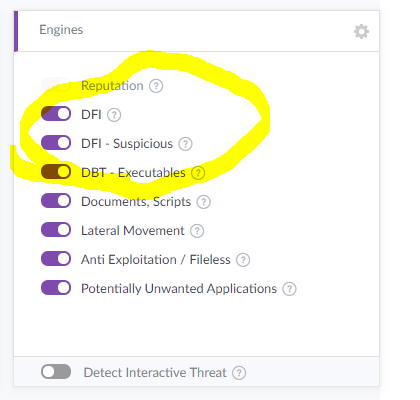
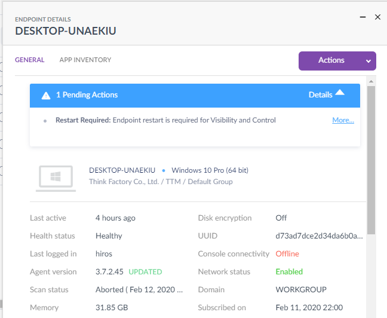

# Sentinel One Doc

## 案件

```
① 特定のワードを含むsyslog or Threatイベントを検出したら、当該デバイスとテナント名を取得し、メッセージを送信
② 各テナントごとにメッセージを設計するUIを設置 (閲覧はTTMのみでOK)
③ は作業量の問題だと思うので、①で何をトリガにするかですね。
今週Webhookの公開時期について回答があるはずなので、それまでは汎用syslogのサンプルを入手してフォーマットを調べつつ、
REST APIでイベントを5分に1回スクレイピングするような仕組みについて考えてみます。
```

## エージェントアンインストール方法

```
① PCでアンインストール→失敗→クラウドでPendingをApprove→いつのまにか消えてる
② クラウドでアンインストールを選択→いつのまにか消えてる
③ PCでアンインストール(Offlineを選択)→クラウドで事前取得したPass Phrase
```

## ダミー脅威のダウンロード

http://2016.eicar.org/85-0-Download.html

## 本番サーバ

https://apne1-1001.sentinelone.net/  
tomo@to-tm.com  
!QAZ2wsx#EDC  

APIドキュメント(ログイン後)  
https://apne1-1001.sentinelone.net/apidoc/

サポートポータル(要ログイン)　Knowledgebase  
https://support.sentinelone.com/hc/en-us  
tomo@to-tm.com  
!QAZ2wsx#EDC  

## テストサーバ情報

https://apne1-1101-nfr.sentinelone.net

eyJ1cmwiOiAiaHR0cHM6Ly9hcG5lMS0xMTAxLW5mci5zZW50aW5lbG9uZS5uZXQiLCAic2l0ZV9rZXkiOiAiZjk0ZTllNGMwYTlhODNmMiJ9

```
BuonoというサイトがPoCユーザー向けのテナントなので、他のサイトを御利用ください。
こっちのサイトにインシデントを発生させる必要があれば、私の方で一台VMをぶら下げておきますので言ってください。
```

## ダミー脅威の使い方





```
脅威名:
脅威レベル:
PC名:
ディレクトリ:
Virustotalへのリンク:
対応ステータス:
```
